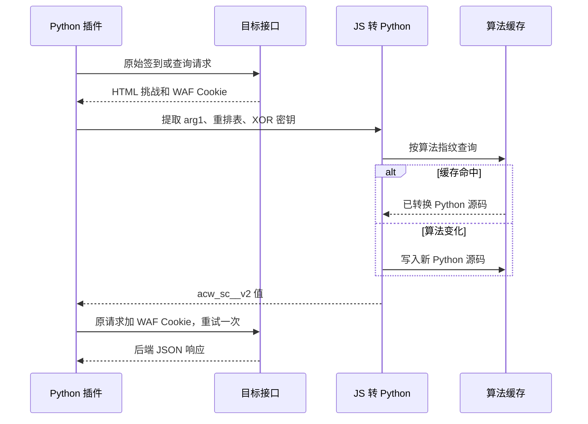

# AnyRouter acw_sc__v2 参数逆向报告

> 分析日期：2026-08-15
> 目标接口：`https://anyrouter.top/api/user/sign_in`
> 目标字段：`acw_sc__v2` Cookie
> 工具链：curl、Python 3.11、aiohttp

> [!IMPORTANT]
> 当前实现针对返回页面中的内联 40 字符重排加十六进制 XOR 算法。功能默认关闭，每次请求最多解算并重试一次，不依赖浏览器或 Node.js。

## 范围

授权、目标和网络边界见 [scope.md](acw_sc_v2/scope.md)。本次只验证指定接口和当前插件，不包含站点扫描、凭据测试或其他风控机制。

## 目标请求

```http
GET /api/user/sign_in HTTP/1.1
Host: anyrouter.top
Accept: application/json, text/plain, */*
```

首次响应为 HTTP 200 HTML，包含动态 `arg1`、40 项字符重排表、经过自定义 Base64 字母表编码的 XOR 密钥，以及写入 `acw_sc__v2` 的逻辑。

## 算法还原

转译器执行以下确定性步骤：

1. 从脚本提取 40 位十六进制 `arg1`。
2. 提取值域为 1-40 的 40 项重排表。
3. 从明文或自定义 Base64 字符串表中恢复 40 位 XOR 密钥。
4. 按重排表重组 `arg1`，每两个十六进制字符与密钥对应字节做 XOR。
5. 生成等价的 `solve_acw_sc_v2(arg1)` Python 源码并编译执行。

算法指纹只包含操作类型、重排表和 XOR 密钥，不包含每次变化的 `arg1`。相同算法直接读取缓存源码，缓存文件不会重写；算法常量变化时才写入新的转换条目。



## 实现位置

| 文件 | 作用 |
|------|------|
| `core/acw_sc_v2.py` | 挑战识别、常量提取、Python 源码生成、指纹缓存和求值 |
| `core/adapters.py` | 保留原鉴权 Cookie，合并 WAF Cookie并重试请求 |
| `pages/checkin_dashboard/index.html` | 站点表单的 Beta 方框选项 |
| `pages/checkin_dashboard/app.js` | `solve_acw_sc_v2` 配置读取与保存 |
| `tests/test_acw_sc_v2.py` | 转译、缓存和请求重试回归测试 |

## Evidence

### E-001

- title: 指定接口返回内联 acw_sc__v2 挑战
- observed_at: 2026-08-15 17:55 +08:00
- source_type: network
- source_ref: `https://anyrouter.top/api/user/sign_in`
- content_hash: n/a
- repro_command: |
    `curl.exe -sS --compressed -D - https://anyrouter.top/api/user/sign_in`
- raw_excerpt: |
    `HTTP/1.1 200 OK`，响应 HTML 中包含 `var arg1='<40 hex>'` 和 `document.cookie='acw_sc__v2='+...`。
- linked_workitem: n/a
- supersedes: none

### E-004

- source_type: live_http
- locator: `GET https://anyrouter.top/api/user/sign_in`
- collected_at: 2026-08-15T18:38:12+08:00
- tool: curl 8.x with response decompression
- content_hash: dynamic response
- repro_command: |
    `curl.exe --compressed -H "Accept: application/json, text/plain, */*" -H "User-Agent: Mozilla/5.0" https://anyrouter.top/api/user/sign_in`
- raw_excerpt: |
    响应脚本的数据流为 `arg1[index]` → 按重排表写入缓冲区 → `join('')` → 与解码密钥逐字节 XOR → 累加到最终 Cookie 变量 → `acw_sc__v2`。
- linked_workitem: PR review hardening
- supersedes: none

### E-002

- title: Python 解算 Cookie 后请求进入后端鉴权层
- observed_at: 2026-08-15 17:58 +08:00
- source_type: network
- source_ref: `https://anyrouter.top/api/user/sign_in`
- content_hash: n/a
- repro_command: |
    运行 `python -m unittest discover -s tests -v` 验证解算与 Cookie 合并，再使用测试凭据执行 `GenericRestAdapter.test_connection()`。
- raw_excerpt: |
    重试响应为 JSON：`{"message":"无权进行此操作，access token 无效","success":false}`，不再返回 HTML 挑战。
- linked_workitem: n/a
- supersedes: none

### E-003

- title: 相同算法不重复写入缓存
- observed_at: 2026-08-15 18:05 +08:00
- source_type: command
- source_ref: `tests/test_acw_sc_v2.py`
- content_hash: n/a
- repro_command: |
    `python -m unittest tests.test_acw_sc_v2.AcwScV2TranslationTests.test_persistent_cache_is_not_rewritten_for_same_algorithm -v`
- raw_excerpt: |
    第二个不同 `arg1` 命中相同算法指纹，缓存文件内容保持不变，算法条目数量为 1。
- linked_workitem: n/a
- supersedes: none

## Findings

### F-001

- title: acw_sc__v2 可由无浏览器依赖的 Python 算法稳定生成
- severity: n/a_re
- category: reverse_algo
- status: validated
- evidence_ids: [E-001, E-002]
- location: `core/acw_sc_v2.py`
- impact: 插件可在服务器侧通过该类 JavaScript 挑战并继续执行原签到请求。
- confidence: high
- repro_steps:
  1. 获取指定接口返回的挑战 HTML。
  2. 调用 `AcwScV2SolverCache.solve()` 生成 Cookie。
  3. 合并响应中的 WAF Cookie 并重试原请求。
- remediation: n/a
- optional_attack:

### F-002

- title: 算法级缓存可忽略动态 arg1
- severity: n/a_re
- category: design
- status: validated
- evidence_ids: [E-003]
- location: `core/acw_sc_v2.py:AcwScV2Algorithm.fingerprint`
- impact: 每次挑战只重新提取动态输入，不重复改写已转换的 Python 代码。
- confidence: high
- repro_steps:
  1. 使用相同算法、不同 `arg1` 连续求解两次。
  2. 比较缓存文件内容和算法指纹。
- remediation: n/a
- optional_attack:

### F-003

- title: 常量提取必须绑定到 Cookie 生成数据流
- severity: n/a_re
- category: parser_validation
- status: validated
- evidence_ids: [E-004]
- location: `core/acw_sc_v2.py:_extract_algorithm_dataflow`
- impact: 页面中的无关重排表或 40 字符字符串不会被误选为挑战算法常量。
- confidence: high
- repro_steps:
  1. 在挑战脚本的真实常量前加入无关重排表和密钥。
  2. 确认转译器仍选择 Cookie 表达式实际引用的重排表与密钥。
  3. 删除重排、XOR 或 Cookie 累加链路，确认转译器拒绝脚本。
- remediation: n/a
- optional_attack:

## Path

### P-001

- title: 从 HTML 挑战到后端 JSON 的调用路径
- path_type: solve
- start: 未携带 `acw_sc__v2` 的原始请求
- goal: 原请求通过 WAF 挑战并到达后端接口
- steps:
  1. action: 获取挑战 HTML 和响应 Cookie；evidence: E-001；finding: F-001
  2. action: 提取算法常量并查询转换缓存；evidence: E-003；finding: F-002
  3. action: 使用 Python 生成挑战 Cookie；evidence: E-002；finding: F-001
  4. action: 合并原鉴权 Cookie、WAF Cookie并重试一次；evidence: E-002；finding: F-001
- residual_risks: 站点切换到不同算法形态、外链脚本或额外设备指纹时，转译器会明确失败并保留原拦截结果。

## 复现

```powershell
python -m unittest discover -s tests -v
python -m py_compile core\acw_sc_v2.py core\adapters.py core\scheduler.py main.py
python -m ruff check core\acw_sc_v2.py core\adapters.py core\scheduler.py main.py tests\test_acw_sc_v2.py
```

真实端点验证应使用测试账号自己的 Token 或 Cookie，不应把凭据写入报告或测试文件。

## Timeline

关键过程见 [timeline.md](acw_sc_v2/timeline.md)。
